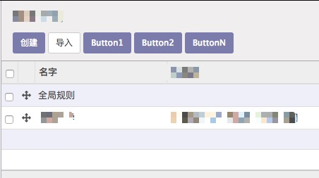

### 0.效果图



### 1.安装本模块

### 2.在对应model里面添加函数

```python
def button1(self, select_ids):
    print select_ids # 选中的订单id
    view_id = self.env.ref('sale.view_order_form').id
    res_id = 10 # 订单id
    res = {
        'type': 'ir.actions.act_window',
        'res_model': 'sale.order',
        'view_type': 'form',
        'view_mode': 'tree, form',
        'views': [(view_id, 'form')],
        'target': 'current',
        'res_id': res_id,
        'context': self._context,
    }
    return res
```

### 3.在要添加button的tree view编辑

```xml
<?xml version="1.0"?>
<!--
buttons: 严格的json格式
-->
<tree buttons='[
          ["method1", "动作1/Action1", "base.group_system"], 
          ["method2", "动作2/Action2", ""], 
          ["method3", "动作3/Action3", "base.group_system,base.group_user"] 
      ]'>
     <field name="sequence" widget="handle"/>
     ...
</tree>
```

### 4.参数解释

- function

`select_ids` tree view中选中的记录的id

- xml

```json
[
  ["method1", "动作1/Action1", "base.group_system"], 
  ["method2", "动作2/Action2", ""], 
  ["method3", "动作3/Action3", "base.group_system,base.group_user"] 
]
```

`method1` 是该model下的函数

`动作1/Action1` 按钮显示的文本(`中文`/`English`)

`base.group_system` 权限组,同`FormView`里面写法

## Ps: 

- ~`DONE` ~~#Todo 之后添加翻译and权限~~

